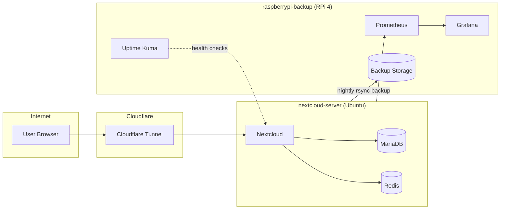

# Self-Hosted Nextcloud Homelab

A two-node home server environment I designed, built, and maintain — running a
production Nextcloud instance with monitoring, automated backups, and secure
remote access. Built as a hands-on project during my transition from physical
labor into IT.

## What this is

This isn't a "spin up a container and walk away" project. It's a real system
with a real user (my partner) depending on it daily for file storage. That
means real stakes: when something breaks, someone notices, and I have to
figure out why and fix it — which has turned this into as much of a
troubleshooting and operations project as a build project.

## Architecture

Two nodes, split by role:

| Node | Hardware | Purpose |
|---|---|---|
| `nextcloud-server` | Ubuntu 24.04 | Runs the actual Nextcloud stack |
| `raspberrypi-backup` | Raspberry Pi 4, Debian 12 | Monitoring + backup destination |

**Main server** — Nextcloud, MariaDB, Redis (caching), plus exporters
(cAdvisor, node-exporter, smart-exporter) feeding metrics to the Pi. Exposed
to the internet via a Cloudflare Tunnel — no ports forwarded on my router.

**Raspberry Pi** — Prometheus and Grafana for metrics, Uptime Kuma for
uptime/alerting, and the destination for nightly `rsync`-over-SSH backups of
the main server's database and files.

*(Full breakdown in [`architecture.md`](./architecture.md).)*

## Tech stack

Docker / Docker Compose · Portainer · Nextcloud · MariaDB · Redis ·
Prometheus · Grafana · Uptime Kuma · Cloudflare Tunnel · rsync/SSH

## Notable problem I found and fixed

During a routine health check, I discovered the nightly backup script had been
silently failing for weeks — it was writing to the wrong path on the Pi,
slowly filling its OS drive to 100% with no errors ever surfacing. The backups
*looked* like they were running fine; they weren't actually protecting
anything. I traced the root cause, corrected the destination path, verified a
clean backup completed successfully, and cleaned up the failed data left
behind.

That fix is what convinced me monitoring and verification aren't the same
thing — a system can run error-free while quietly not doing its job. Full
writeup in [`incident-report.md`](./incident-report.md).

## Status

Actively maintained. Currently running Nextcloud 32.0.14, which reaches
end-of-life this month — an upgrade to 33.x is planned and tracked in
[`known-issues.md`](./known-issues.md) along with everything else I know is
imperfect about this setup and haven't gotten to yet.

## Docs in this repo

- [`architecture.md`](./architecture.md) — full node-by-node breakdown
- [`incident-report.md`](./incident-report.md) — the backup failure writeup
- [`known-issues.md`](./known-issues.md) — what's known-broken or planned
- [`changelog.md`](./changelog.md) — dated log of changes over time

## About me

Career-changer moving from delivery/logistics into IT support. This homelab
is where I actually learn by breaking and fixing things on a system that
matters, rather than just following a tutorial once and moving on.
